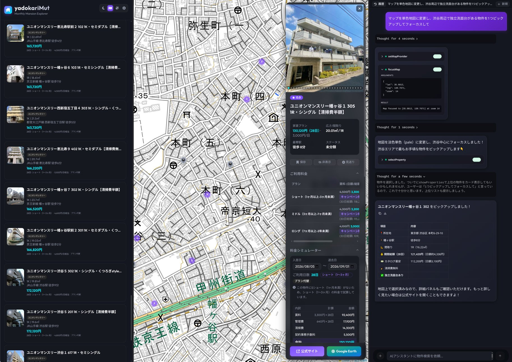
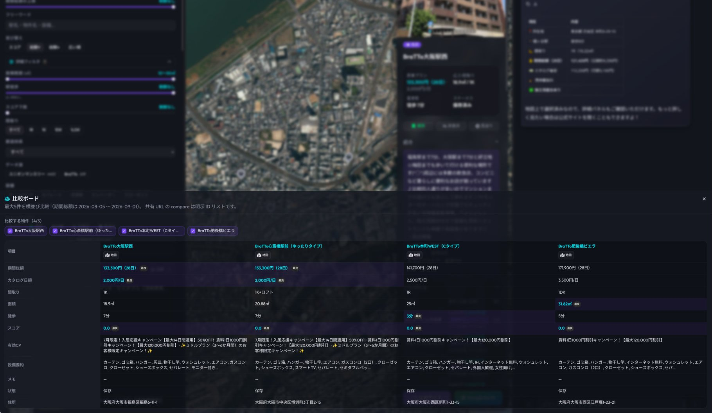
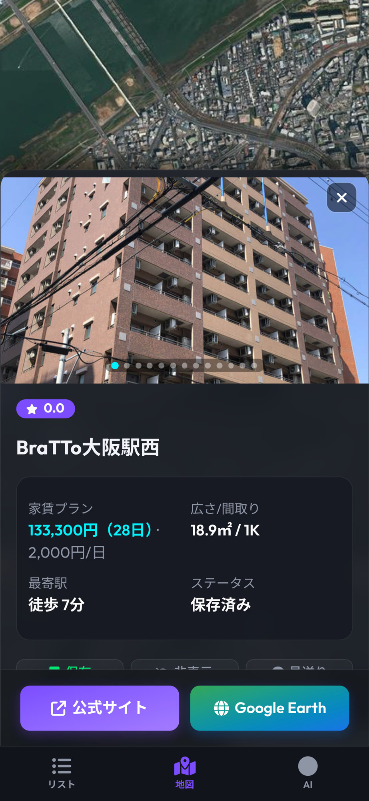
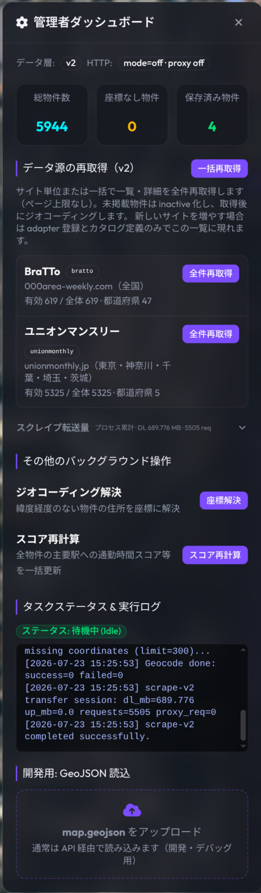
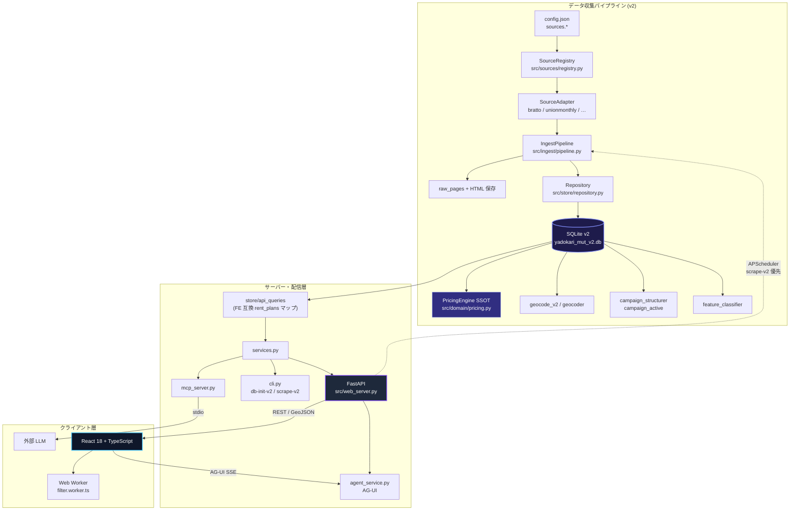
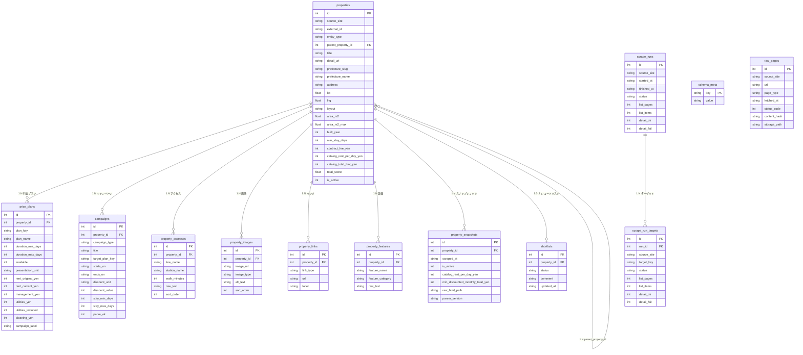

# YadokariMut

YadokariMut はマンスリーマンションを効率的に比較・探索するためのダッシュボード型 Web システムです。

**多ソース収集**、各種追加費用やキャンペーンを適用した **滞在期間ベースの実質総額**、比較ボード、LLM / MCP 連携を統合しています。

> **status:** 開発先端ベースのスナップショットを公開した状態です。安定後はバージョンごとにスナップショットを反映します。 プルリク大歓迎です！</br>
> **データ層の既定:** 現行仕様は **v2**（`yadokari_mut_v2.db` / `YADOKARIMUT_DATA_LAYER=v2`）です。v1（`yadokari_mut.db` + `rent_plans`）は互換のためのレガシー経路です。

---

## スクリーンショット

### ホーム



### 比較ボード



### モバイル（物件詳細）・管理者ダッシュボード

| モバイル（物件詳細） | 管理者ダッシュボード |
| :---: | :---: |
|  |  |

---

## 主な機能

### 1. インタラクティブ地図とリアルタイム探索

- **マップ連動ビュー**: Leaflet およびクラスタリング。地図の移動・ズームに合わせて表示物件が更新されます。
- **クライアントサイド高速フィルタ**: 都道府県、**データソース**、価格帯、間取り、築年数、最寄り駅徒歩分数、設備条件などを即座に絞り込み。大量データでも Web Worker により UI をブロックしません。

### 2. 多ソース対応のデータ収集

- **SourceAdapter + Registry**: サイトごとに一覧・詳細の取得と正規化を実装（現状: **BraTTo** / **Union Monthly**）。
- **v2 スキーマ**: 掲載 identity は `(source_site, external_id)`。料金は期間帯 + 提示単位（日額/月額）の `price_plans`。
- **管理 UI / API**: ソース別・都道府県単位の再収集、実行履歴（`scrape_runs` / `scrape_run_targets`）。

### 3. 滞在期間ベースの実質総額シミュレータ

- **期間指定試算**: チェックイン / チェックアウトから契約帯（ショート・ミドル・ロング等）を `duration_*` で自動判定。
- **料金 SSOT**: バックエンドは `src/domain/pricing.py`（PricingEngine）。API は FE 互換のため `rent_plans` 形にもマップして返却。
- **キャンペーン**: 条件付き割引の構造化と、指定期間での有効性判定を反映した総額・日割り単価でソート可能。

### 4. ショートリストと比較ボード

- **検討中物件の保管**: 状態（検討中・非表示・見送り）とメモ。
- **横並び比較**: 料金内訳、間取り、面積、設備、アクセスを一覧表示。

### 5. AI アシスタント & MCP

- **CopilotKit / AG-UI**: 画面チャットからフィルタ適用・比較・地図操作などを連動。
- **MCP**: `cli.py run-mcp` で外部 LLM クライアントから検索・詳細・比較・ショートリスト・GeoJSON 出力が可能。

### 6. URL 状態再現 & PWA

- **ディープリンク**: 期間・フィルタ・物件 ID・比較対象などが TanStack Router の search params に保持され共有可能。
- **モバイル / PWA**: 「地図」「リスト」「詳細・比較」タブとホーム画面追加に対応。

---

## デプロイ(Docker Compose)

環境変数や API キーの詳細は後述の [共通セットアップ](#共通セットアップ) を参照してください。

```bash
cp .env.example .env
# DEEPSEEK_API_KEY 等を設定（.env.example 参照）
```

> **Note**: `DEEPSEEK_API_KEY` なしでも動くかもしれません(動作未確認)

```bash
# バインドマウント用に空dbを作成
touch yadokari_mut_v2.db yadokari_mut.db
mkdir -p data

docker compose up --build -d
docker compose logs -f
```

| 項目 | 内容 |
|------|------|
| 公開ポート | `127.0.0.1:8000`（API + 静的 UI） |
| データ層 | `YADOKARIMUT_DATA_LAYER=v2`（compose 既定） |
| 永続化 | `./yadokari_mut_v2.db`, `./yadokari_mut.db`, `./data`, `./config.json`, `./.env` |
| 定期収集 | `ENABLE_SCHEDULER=true` + `SCHEDULER_CRON`（既定は毎日 2:00 相当、**scrape-v2 優先**） |

初回のデータ投入例（コンテナ内）:

```bash
docker compose exec yadokari-mut python3 cli.py db-init-v2
docker compose exec yadokari-mut python3 cli.py scrape-v2 --source unionmonthly --pref osaka --pages 1 --delay 2.0
```

アクセス: `http://127.0.0.1:8000/`  

---

## MCPとして利用

```bash
source .venv/bin/activate
python3 cli.py run-mcp
```

設定例（**本リポジトリの絶対パス**に置き換え）:

```json
{
  "mcpServers": {
    "yadokariMut-explorer": {
      "command": "/path/to/yadokariMut/.venv/bin/python3",
      "args": ["/path/to/yadokariMut/cli.py", "run-mcp"]
    }
  }
}
```

主なツールの例: `search_properties`, `get_property_detail`, `compare_properties`, `get_shortlist`, `export_map_data`

---

## 利用上の注意・免責事項

- 本ソフトウェアは **MIT License** で提供されます（`LICENSE` 参照）。
- 第三者サイトからのデータ取得機能が含まれます。**利用規約・robots.txt・関連法令を遵守し、自己責任で運用**してください。
- リポジトリに **物件 DB・生 HTML・取得成果物は同梱されていません**。各自で初期化・取得してください。

---

## 技術的詳細

### システムアーキテクチャ



**読み取り経路の切替**（`src/store/api_queries.py` の `use_v2_data_layer()`）:

| 条件 | 使用データ層 |
|------|----------------|
| `YADOKARIMUT_DATA_LAYER=v2` | v2（推奨・Docker Compose 既定） |
| `YADOKARIMUT_DATA_LAYER=v1` | v1 レガシー |
| 未設定 | `YADOKARIMUT_V2_DB_PATH` がある、または既定の `yadokari_mut_v2.db` が存在すれば v2、なければ v1 |

v1 レガシー経路: `src/scraper.py` + `src/parser.py` + `src/database.py` → `yadokari_mut.db`（`rent_plans`）。新規運用では v2 を使ってください。

---

### データベース構造

正本 DDL は **`src/store/schema.py`**（`schema_version = 2`）。DB ファイル既定は **`yadokari_mut_v2.db`**（環境変数 `YADOKARIMUT_V2_DB_PATH`）。



#### 主要テーブル解説

- **`properties`**: 多ソース物件の現在値。identity は `UNIQUE(source_site, external_id)`。`entity_type`（room / building / plan 等）と `parent_property_id` で階層を表現可能。検索用キャッシュとして `catalog_rent_per_day_yen` 等を保持。
- **`price_plans`**: v2 料金テーブル（v1 の `rent_plans` 後継）。帯判定は **`duration_min_days` / `duration_max_days`**。`presentation_unit` は `per_day` | `per_month`（月額は PricingEngine が 30 日換算で日額化）。
- **`campaigns`**: 条件付き割引・特典。対象プランは **`target_plan_key`**（v1 の `target_plan_code` ではない）。
- **`property_accesses` / `property_images` / `property_links` / `property_features`**: 交通・画像・外部リンク・設備タグ。
- **`property_snapshots`**: 取得時点の履歴（カタログ賃料・raw 参照など）。
- **`shortlists`**: ユーザーの検討状態（`property_id` は UNIQUE → 物件あたり 0..1 行）。
- **`scrape_runs` / `scrape_run_targets`**: ソース単位の実行と、県などターゲット単位の進捗。
- **`schema_meta`**: `schema_version = 2`。
- **`raw_pages`**: 生 HTML メタデータ（再パース・差分用。物件への FK は持たない）。

---

### データパイプラインと処理フロー

```text
[1. discover/list] → [2. detail parse] → [3. persist v2] → [4. enrich]
 SourceAdapter        Adapter + Domain      Repository         geocode / campaign
 config sources.*     models               price_plans 等      feature / score
        └──────── IngestPipeline (src/ingest/pipeline.py) ────────┘
                              ↓
              PricingEngine (読み取り時・検索時の stay / effective)
                              ↓
                    API / MCP / GeoJSON / Frontend
```

1. **一覧・詳細収集 (`scrape-v2` / `IngestPipeline`)**  
   - `config.json` の `sources.<id>` と `SourceRegistry` で Adapter を起動。  
   - 一覧ページング → 詳細 HTML 取得 → Domain DTO へ正規化 → `Repository` で upsert。  
   - 生 HTML は `raw_pages` / ストレージに保存可能（`--no-raw` で省略可）。
2. **永続化 (`src/store/`)**  
   - DDL は `schema.py`。読み取り API 形への変換は `api_queries.py`（`price_plans` → FE 互換 `rent_plans`）。
3. **料金計算 (`src/domain/pricing.py`)**  
   - stay 日数 inclusive、帯は duration マッチ、月額は `MONTH_DAYS=30` で日額化。  
   - 総額 ≈ (賃料日額 + 管理日額 + 光熱日額*) × 日数 + 清掃 + 契約手数料。
4. **ジオコーディング**  
   - v2: `store/geocode_v2.py` 等。住所 → lat/lng（Nominatim / Google 等）。
5. **キャンペーン・設備**  
   - `campaign_structurer` / `campaign_active`、`feature_classifier` で構造化・正規化。
6. **スコア**  
   - `commute_scorer` 等（総合・徒歩・面積・築年など）。※一部ユーティリティは v1 テーブル前提の名残があり、v2 移行中のモジュールがあります。

CLI 対応表:

| 目的 | コマンド |
|------|----------|
| v2 スキーマ初期化 | `python3 cli.py db-init-v2` |
| 多ソース収集 | `python3 cli.py scrape-v2 --source unionmonthly --pref osaka --pages 1` |

---

### 技術スタック一覧

| 領域 | 技術・ライブラリ | 概要・用途 |
|------|------------------|------------|
| **Back-end Core** | Python 3.10+, SQLite3 | 言語基盤・DB（v2 既定） |
| **Ingest** | SourceAdapter / Registry / IngestPipeline | 多ソース収集・正規化 |
| **Domain** | `domain/pricing.py`, `domain/models.py` | 料金・DTO の SSOT |
| **Store** | `store/schema.py`, `repository.py`, `api_queries.py` | v2 DDL・永続化・読取 |
| **Web Server API** | FastAPI, Uvicorn, Pydantic | REST / GeoJSON / Admin / AG-UI |
| **Agent / AI** | CopilotKit v2, AG-UI Protocol | UI 連動エージェント |
| **LLM Integration** | MCP | 外部 LLM ツール |
| **Task Schedule** | APScheduler | 定期 scrape-v2（Compose 既定） |
| **Front-end Core** | React 18, TypeScript, Vite, **pnpm** | UI |
| **Routing / State** | TanStack Router | URL search 同期 |
| **Map & Visual** | Leaflet, MarkerCluster | 地図 |
| **UI** | Tailwind CSS, shadcn/ui, Lucide | コンポーネント |
| **Performance** | Web Worker (`filter.worker.ts`) | 大量フィルタ |

---

### ディレクトリ・モジュール構造

```text
yadokariMut/
├── cli.py                      db-init-v2 / scrape-v2 / score / run-mcp 等
├── mcp_server.py               MCP サーバー
├── config.json                  sources.* を含む設定
├── Dockerfile / docker-compose.yml
├── requirements.txt
├── .env.example
├── src/
│   ├── store/                  ★ v2 データ層
│   │   ├── schema.py           v2 DDL (schema_version=2)
│   │   ├── repository.py       永続化
│   │   ├── api_queries.py      読取・DATA_LAYER 切替・FE 互換マップ
│   │   ├── source_catalog.py   ソース一覧・管理 API 用
│   │   ├── pref_master.py
│   │   └── geocode_v2.py
│   ├── sources/                ★ サイト別 Adapter
│   │   ├── base.py / registry.py
│   │   ├── bratto/
│   │   ├── unionmonthly/
│   │   └── http/               取得 HTTP・プロキシ骨格
│   ├── ingest/
│   │   ├── pipeline.py         list→detail→upsert オーケストレーション
│   │   └── raw_store.py
│   ├── domain/
│   │   ├── pricing.py          料金 SSOT
│   │   └── models.py
│   ├── services.py             検索・詳細・比較・shortlist（v1/v2 分岐）
│   ├── web_server.py           FastAPI（/api, admin scrape-v2, AG-UI）
│   ├── agent_service.py
│   ├── campaign_structurer.py / campaign_active.py
│   ├── feature_classifier.py
│   ├── geocoder.py
│   ├── database.py             レガシー v1 DDL (yadokari_mut.db)
│   ├── scraper.py / parser.py  レガシー v1 BraTTo 経路
│   └── …
└── frontend/
    ├── src/
    │   ├── main.tsx            エントリ (Router + CopilotKit)
    │   ├── App.tsx             地図・サイドバー・詳細・比較の統合 UI
    │   ├── router.tsx / routes/
    │   ├── components/
    │   ├── lib/                filterLogic, rentCalculator, explorerSearch
    │   ├── hooks/
    │   ├── types.ts            source_site / source_display_name 等
    │   └── workers/filter.worker.ts
    └── package.json
```

---

## 共通セットアップ

[デプロイ](#デプロイ)・[ローカル開発](#ローカル開発手順) 共通のセットアップです。

### 前提条件

| 用途 | 要件 |
|------|------|
| バックエンド | **Python 3.10+**（作業は必ず仮想環境 `.venv` 内） |
| フロント | **Node.js 18+**、パッケージ管理は **pnpm** |
| デプロイ | Docker / Docker Compose（[デプロイ](#デプロイ) 節） |

### リポジトリ取得と設定ファイル

```bash
git clone https://github.com/0-a-e/yadokariMut
cd yadokariMut
cp .env.example .env
```

スクレイプ対象・ソース有効化などは **`config.json`**（リポジトリ同梱）を編集します。API キーは `config.json` ではなく **`.env`** に書いてください。

### 環境変数・API キー一覧

テンプレート:  **`.env.example`**

#### 最低限（.env.exampleに設定済み）

| 変数 | 必須? | 説明 |
|------|--------|------|
| `YADOKARIMUT_DATA_LAYER` | 推奨 | `v2`（現行）または `v1`（レガシー）。**Compose 既定は `v2`**。未設定時は v2 DB の有無で自動判定 |
| `YADOKARIMUT_V2_DB_PATH` | 任意 | v2 SQLite のパス。未設定時はプロジェクト直下の `yadokari_mut_v2.db` |

#### API キー

| 変数 | 役割 | 説明 |
|------|------|------|
| `DEEPSEEK_API_KEY` | 推奨 | [DeepSeek](https://platform.deepseek.com/) の API キー。画面内 AI チャット機能やキャンペーン・設備の LLM 分類で使用。無くても動くかもだが動作未確認 |
| `GOOGLE_MAPS_API_KEY` | Google ジオコード時 | 未設定でも Nominatim 等の標準経路で利用可能 |
| `DEEPSEEK_BASE_URL` | 任意 | 既定 `https://api.deepseek.com` |
| `DEEPSEEK_MODEL` | 任意 | 既定 `deepseek-v4-flash` |


```bash
# .env の例（値は自分のキーに置き換え）
...
DEEPSEEK_API_KEY=...
# Google ジオコードを使う場合
# GOOGLE_MAPS_API_KEY=...
...
```

#### 運用・収集まわり（任意）

| 変数 | 既定の目安 | 説明 |
|------|------------|------|
| `ENABLE_SCHEDULER` | Compose: `true` / ローカル: 未設定なら off | `true` で APScheduler による定期 scrape-v2 |
| `SCHEDULER_CRON` | `0 2 * * *` | 定期実行の cron 式（例: 毎日 2:00） |
| `YADOKARIMUT_CHECKPOINT_DB` | `data/agent_checkpoints.db` 相当 | エージェント／チャットスレッド用 SQLite |
| `SCRAPE_HTTP_MODE` | `off` | 収集 HTTP: `off` / `fallback` / `always_proxy` |
| `SCRAPE_HTTP_PROXY` | （なし） | プロキシ URL（`fallback` / `always_proxy` 時） |
| `SCRAPE_HTTP_MAX_RETRIES` | `2` | 取得リトライ回数 |
| `SCRAPE_HTTP_TIMEOUT_SECONDS` | `45` | タイムアウト秒 |
| `SCRAPE_PROXY_COOLDOWN_SECONDS` | `600` | プロキシ冷却秒 |

---

## ローカル開発手順

### 1. Python 環境と v2 DB

```bash
python3 -m venv .venv
source .venv/bin/activate
pip install -r requirements.txt

# 多ソース v2 スキーマ（現行）
python3 cli.py db-init-v2
```

`.env` で `YADOKARIMUT_DATA_LAYER=v2` を設定済みなら、CLI / API は v2を読む。シェルで明示する場合:

```bash
export YADOKARIMUT_DATA_LAYER=v2
export YADOKARIMUT_V2_DB_PATH="$(pwd)/yadokari_mut_v2.db"
```

### 2. データ投入

リポジトリに物件データは含まれません。Frontendから操作するか、以下のコマンドで取得できます。

```bash
# Union Monthly（--source 省略時のデフォルトは unionmonthly）
python3 cli.py scrape-v2 --source unionmonthly --pref osaka --pages 1 --delay 2.0

# BraTTo
python3 cli.py scrape-v2 --source bratto --pref osaka --pages 1 --delay 1.5

# よく使うオプション
#   --all-pages      一覧を最後まで
#   --list-only      詳細を取らない
#   --max-details N  詳細件数上限
#   --mark-inactive  今回見えなかった ID を inactive
```

座標が空の物件がある場合:

```bash
python3 cli.py geocode --limit 50
```

### 3. 開発サーバー（API + フロント）

**ターミナル 1 — FastAPI（`:8000`）**

```bash
source .venv/bin/activate
# .env を読まない起動方法の場合は export を併用
export YADOKARIMUT_DATA_LAYER=v2
uvicorn src.web_server:app --host 0.0.0.0 --port 8000 --reload
```

**ターミナル 2 — Vite（`:5173`）**

```bash
cd frontend
pnpm install
pnpm dev
```

- UI: `http://localhost:5173/`
- `/api` は Vite プロキシ経由で `localhost:8000` へ転送

---

## テストの実行

### バックエンド

```bash
source .venv/bin/activate
export PYTHONPATH=src

python3 -m unittest test_system.py
python3 -m unittest test_campaign_active.py
python3 -m unittest test_campaign_structurer.py
python3 -m unittest test_web_api.py
python3 -m unittest test_domain_pricing.py
python3 -m unittest test_store_repository.py
python3 -m unittest test_bratto_adapter.py
python3 -m unittest test_unionmonthly_parsers.py
python3 -m unittest test_ingest_pipeline_prefs.py
python3 -m unittest test_admin_sources.py
```

### フロントエンド

```bash
cd frontend
pnpm test
pnpm exec tsc --noEmit
```

---

## 謝辞

複数ソース対応に当たって[notLukeshi/apt-finder](https://github.com/notLukeshi/apt-finder)を参考にさせて頂きました。この場を借りて感謝申し上げます。

---

## ライセンス

[MIT License](LICENSE)
